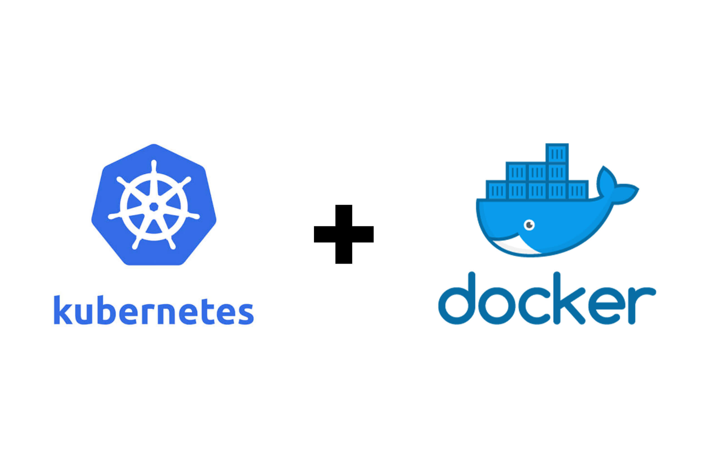
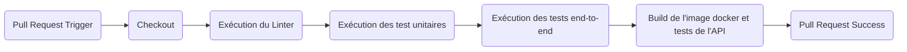

# TP-SYSOPS
Un TP sur Docker, Kubernetes, Azure et la CI/CD

<p align="center">
  
</p>

## Objectifs du TP

Le repository ci-présent contient le code source d'une application web en Node.js 16. L'application expose une REST
API pour la calculer la suite de Fibonacci :

Pour installer Node.js, vous pouvez installer et utiliser [NVM](https://github.com/nvm-sh/nvm).

Installation des dépendances, dont celles de dev :

```
$ npm install --dev
```

Installation des dépendances, sans celles de dev :

```
$ npm install --omit dev
```

Démarrage du serveur :

```
$ npm start

> tp-devops@1.0.0 start
> node index.js

Server 55795 running !
```

Requête HTTP au serveur:

```
$ curl http://localhost:1234/20 -H "Content-Type: application/json"
{"entry":"20","result":6765}
```

Le code source contient également des tests (linter, unitaires, end-to-end) pour assurer la robustesse du code

À partir de cet existant, en groupe de 4 élèves, le but est de créer un workflow d'intégration continue/déploiement
continu (CI/CD) sous Github Action avec **Kubernetes**.

- Le workflow de CI va permettre de tester la non-régression du code de l'application avant le merge
  d'une pull request.
- Le workflow de CD va permettre de créer un artifact et le déployer sur le cloud Azure lorsqu'une pull request
  est mergée sur la branche main.

Pour accomplir cette mission, vous devrez travailler en équipe en vous organisant et en vous séparant les tâches dans un
[Trello](https://trello.com/). Le but est de découvrir les conteneurs Docker et leurs orchestrations sous Kubernetes.


Vous forkerez ce repository pour travailler dessus, configurerez les accès aux membres de votre équipe.
Attention à ne pas stocker de données sensibles dans votre repo.


### Création de l'image Docker

À partir du code de l'application, vous devrez remplir le Dockerfile pour créer une image Docker de l'application.

Vous pourrez lors de vos tests, utiliser [Docker Desktop](https://www.docker.com/products/docker-desktop/) pour 
travailler avec Docker en local.

Vous testerez que l'image et que le conteneur fonctionne bien en local.

#### Ressources
- https://learn.microsoft.com/fr-fr/visualstudio/docker/tutorials/docker-tutorial
- https://www.tutos.eu/3448

### Création du Workflow d'Intégration Continue (CI)

Vous devrez créer le workflow de CI avec GitHub Actions dans `.github/ci.yml`. 

Ce workflow va exécuter les tâches suivantes (jobs):



En plus d'exécuter les tests propres au code, le workflow va builder l'image Docker. Il va ensuite le lancer
et effectuer des tests dessus comme par exemple:

```
$ curl http://localhost:1234/20 -H "Content-Type: application/json"
{"entry":"20","result":6765}
```

### Création des manifestes Kubernetes

Docker Desktop permet également de lancer un Kubernetes local. Vous pourrez développer les manifestes Kubernetes
pour l'application. Il faudra au préalable que vous buildez l'image docker dans votre registry local (`docker build`).
En complément, vous aurez besoin de la command [kubectl](https://kubernetes.io/fr/docs/tasks/tools/install-kubectl/).
Vous pouvez aussi utiliser [Lens](https://k8slens.dev/) qui est un IDE pour Kubernetes.

Les manifestes Kubernetes sont à écrire dans `.devops/kubernetes`. L'application est stateless et nécessite les objets 
suivants :
- [Deployment](https://kubernetes.io/docs/concepts/workloads/controllers/deployment/)
- [Service](https://kubernetes.io/fr/docs/concepts/services-networking/service/)
- [Ingress](https://kubernetes.io/docs/concepts/services-networking/ingress/)
- [ServiceAccount](https://kubernetes.io/docs/concepts/security/service-accounts/)
- [HPA](https://kubernetes.io/docs/tasks/run-application/horizontal-pod-autoscale/)

Pour l'ingress, vous pouvez utiliser [NGINX Ingress Controller](https://docs.nginx.com/nginx-ingress-controller/).
Il faudra l'installer sur le cluster Kubernetes (local et sur Azure)

#### Ressources
- https://spacelift.io/blog/kubernetes-tutorial
- https://blog.stephane-robert.info/post/kubernetes-start-with-manifest-writing/
- https://devopscube.com/create-kubernetes-yaml/

### Déploiement de l'infrastructure Azure avec Terraform

Le but final est de déployer l'application Kubernetes dans le cloud d'Azure. Pour cela, il faudra utiliser Terraform.
Il faudra déployer le réseau ainsi qu'un cluster Kubernetes managé (AKS). 

Vous devrez également utiliser un [backend Azure](https://developer.hashicorp.com/terraform/language/settings/backends/azurerm) 
pour Terraform.

Vous pourrez également installer le NGINX controller sur le cluster en utilisant Terraform. Il y a plusieurs solutions
pour gérer son installation via Terraform :
* Avec le Helm :
  * https://registry.terraform.io/providers/hashicorp/helm/latest/docs
  * https://docs.nginx.com/nginx-ingress-controller/installation/installation-with-helm/
* À partir du manifeste :
  * https://registry.terraform.io/providers/hashicorp/kubernetes/latest/docs/resources/manifest

**⚠️ Pour une raison de coût, pensez bien à détruire vos resources Azure avec un `terraform destroy` lorsque vous ne 
travaillez plus sur le TP**

#### Ressources

- https://learn.microsoft.com/fr-fr/azure/developer/terraform/create-k8s-cluster-with-tf-and-aks
- https://developer.hashicorp.com/terraform/tutorials/kubernetes/aks

### Création du Workflow de Déploiement Continu (CD)

Le workflow de CD va provisionner l'infrastructure avec Terraform. Ensuite, il déploiera l'application dans le cluster
Azure AKS. Le workflow est à définir dans `.github/cd.yml`.

#### Ressources

- https://github.com/actions-hub/kubectl
- https://github.com/hashicorp/setup-terraform

### Bonus : Créer un package Helm pour l'application Kubernetes

[Helm](https://helm.sh/) est un package manager pour les applications Kubernetes. Il permet de créer un package 
réutilisable, customisable et de le partager. Le but ici est de convertir les manifestes Kubernetes précédent en Helm 
chart.

#### Ressources
- https://helm.sh/docs/
- https://jfrog.com/blog/10-helm-tutorials-to-start-your-kubernetes-journey/
